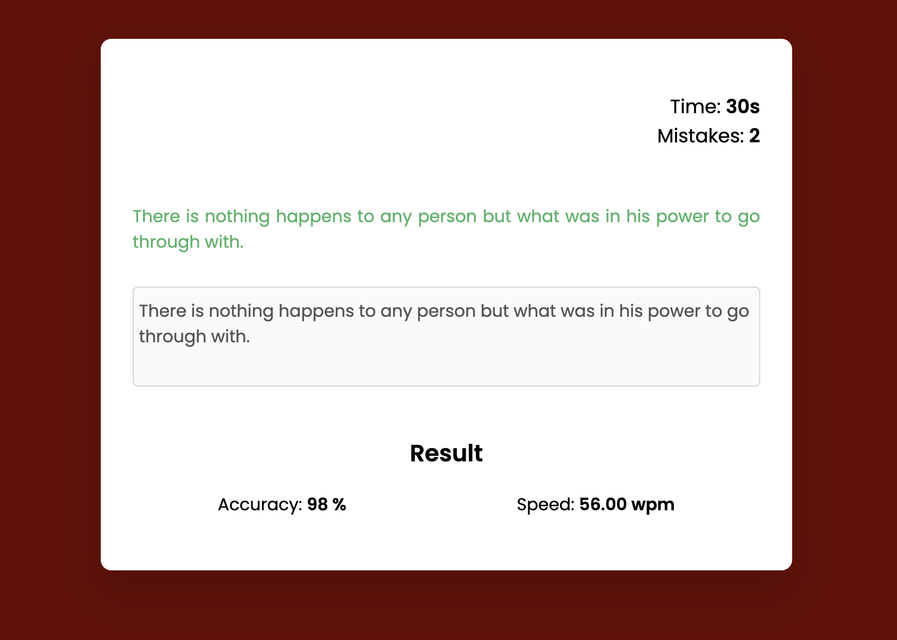

# __Typing Test__ 

This is a simple typing test application developed using JavaScript. It allows users to test their typing speed and accuracy by typing a given passage within a specified time limit.

## __Features__

- Typing speed measurement: The application measures the typing speed of the user in words per minute (WPM).
- Accuracy calculation: It calculates the accuracy of the typing by comparing the typed text with the original passage.
- Timer: The application has a timer that starts when the user begins typing and stops when the time limit is reached.
- Responsive design: The application is designed to work well on different screen sizes, including desktops, tablets, and mobile devices.

## __How to Use__

1. Open the application in a web browser.
2. Choose a passage from the provided list or enter your own passage.
3. Click the "Start" button to begin the typing test.
4. Start typing the passage in the text input area.
5. Once you finish typing or when the time runs out, the application will display your typing speed and accuracy.
## __Screenshots__

